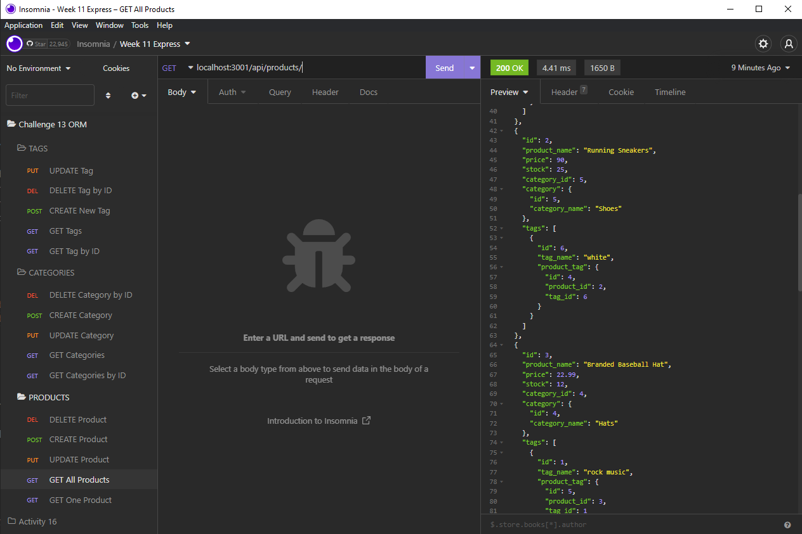
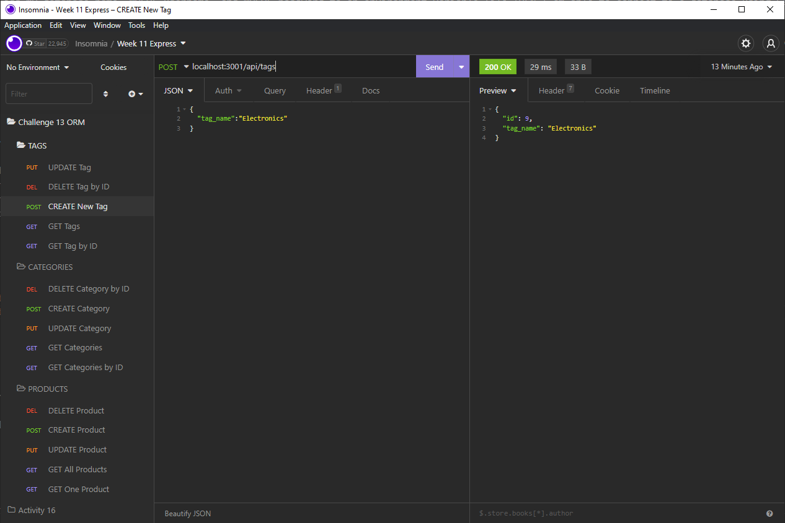

# Handy Ecommerce Back End

This was the Eleventh challenge assignment for our UPENN Bootcamp. We were tasked with creating an Ecommerce Back End that allowed a user to run CRUD operations on it. (See **User Story** and **Acceptable Criteria** sections below).

---

## 📕 User Story

AS A manager at an internet retail company I WANT a back end for my e-commerce website that uses the latest technologies SO THAT my company can compete with other e-commerce companies

---

## ✔️ Acceptable Criteria

- GIVEN a functional Express.js API
- WHEN I add my database name, MySQL username, and MySQL password to an environment variable file THEN I am able to connect to a database using Sequelize
- WHEN I enter schema and seed commands THEN a development database is created and is seeded with test data
- WHEN I enter the command to invoke the application THEN my server is started and the Sequelize models are synced to the MySQL database
- WHEN I open API GET routes in Insomnia for categories, products, or tags THEN the data for each of these routes is displayed in a formatted JSON
- WHEN I test API POST, PUT, and DELETE routes in Insomnia THEN I am able to successfully create, update, and delete data in my database

---

## 🔧 Optimizations

### Javascript

- Allows user to CREATE, REMOVE, UPDATE & DELETE information on the back end using Sequelize
- Our information was stored in a MySQL Database and was retrieved using routes on an express server using Sequelize
- Used Insomnia to successfully test each CRUD operation
- Uses the MySQL2, Sequelize, Dotenv & Express npm modules
- Uses Dotenv to hide private user information

---

## 📷 Screenshots

---

## 🎯 Deployment

Repository: https://github.com/alvinkp/HandyEcommerceBackEnd

Video Walkthrough: https://drive.google.com/file/d/10ft6xAeKVxTKjPmzfz_E5hFB_KCKMBYg/view

---

## ✉️ Authors

- [@alvinkp](https://www.github.com/alvinkp)
